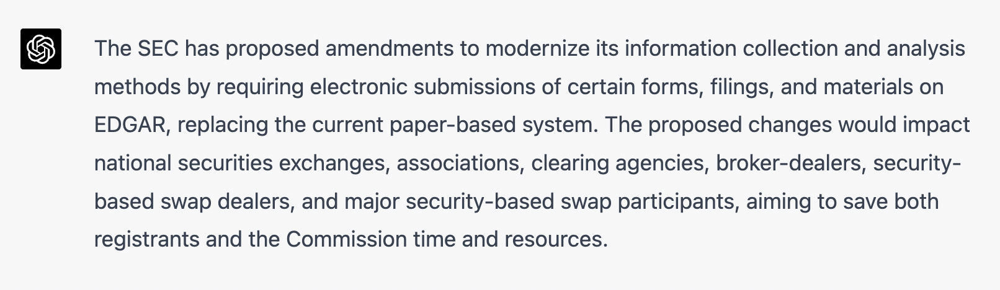
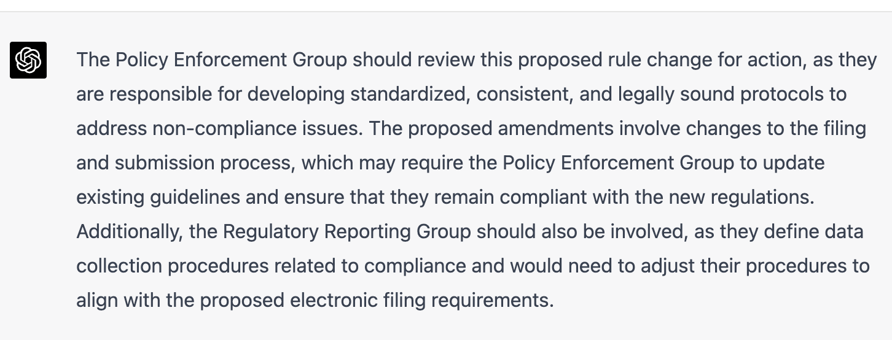
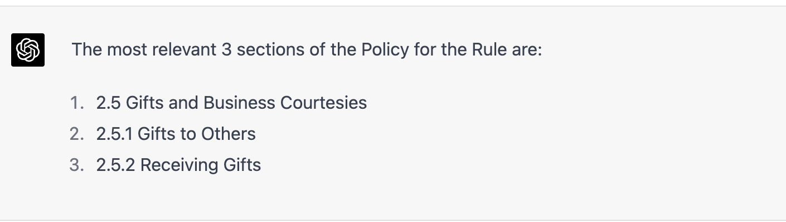
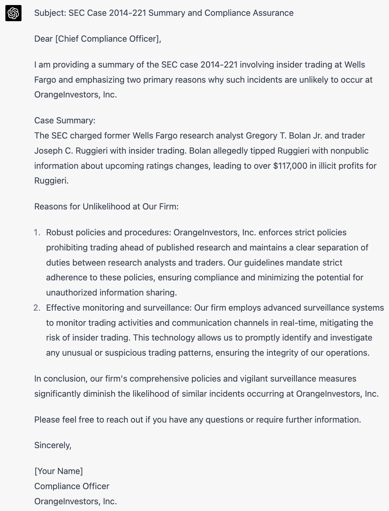
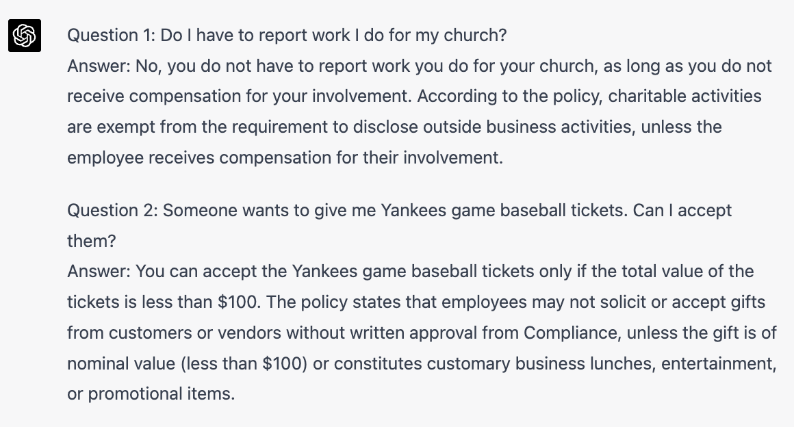
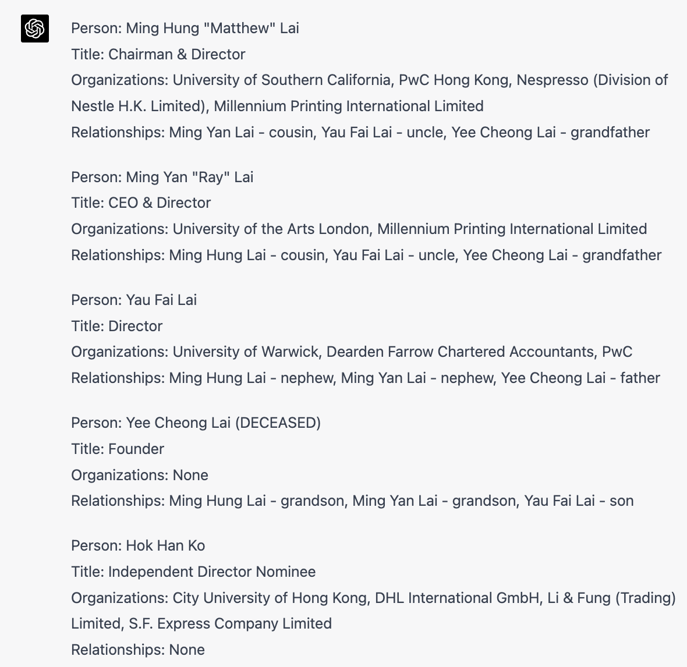
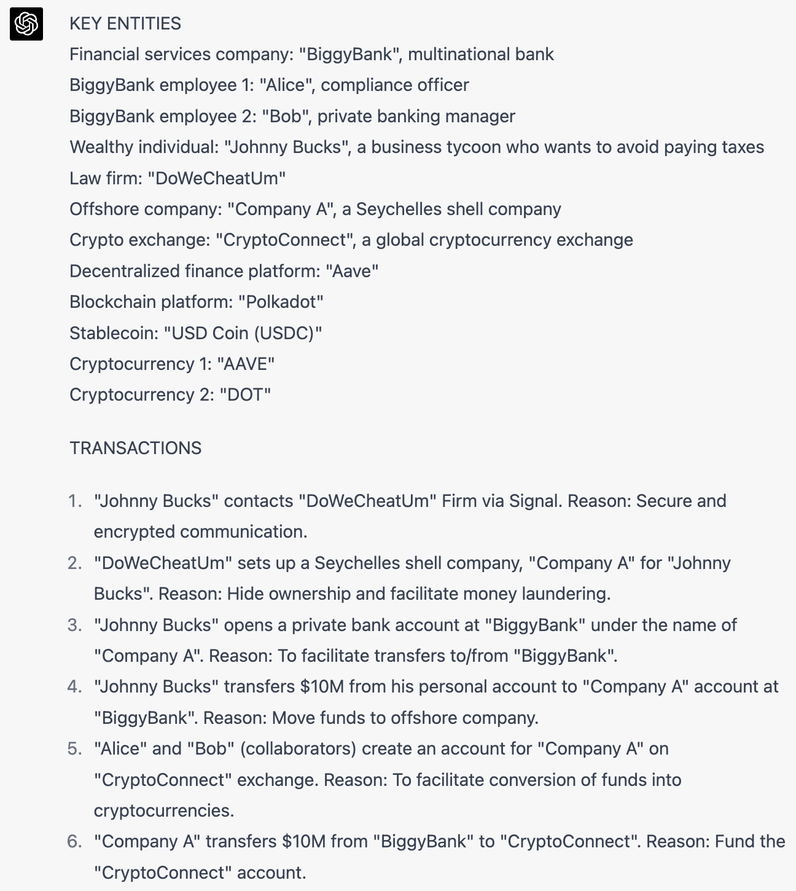
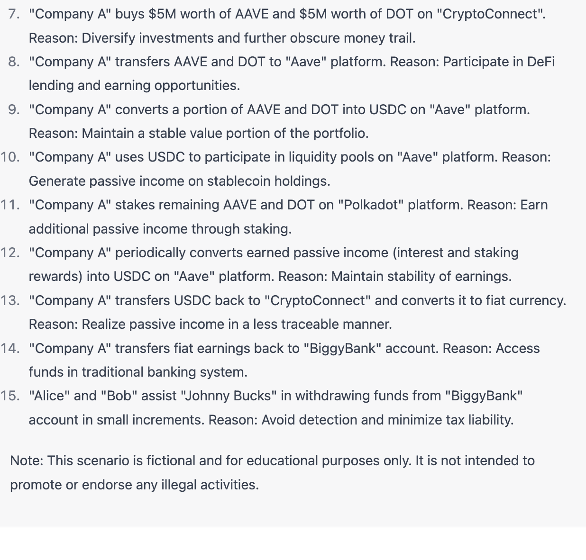
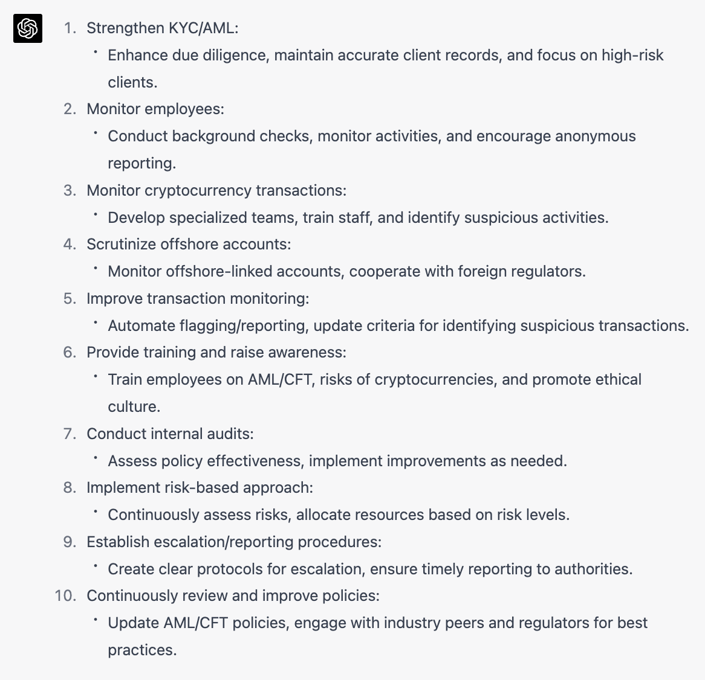

## Compliance, regulation, surveillance, and risk applications
- [Summarizing rules](#summarizing-rules)
- [Routing rule changes to the appropriate compliance function](#routing-rule-changes-to-the-appropriate-compliance-function)
- [Tracing rules to policy documents](#tracing-rules-to-policy-documents)
- [Detecting potential risk and policy loopholes from cryptocurrency transactions](#detecting-potential-risk-and-policy-loopholes-from-cryptocurrency-transactions)
- [Automatically generating draft reports and correspondence](#automatically-generating-draft-reports-and-correspondence)
- [Answering questions about policies](#answering-questions-about-policies)
- [Identifying people, places, organizations, and relationships in documents](#identifying-people-places-organizations-and-relationships-in-documents)
- [Designing and preventing risk scenarios or financial crimes](#designing-and-preventing-risk-scenarios-or-financial-crimes)


### Summarizing rules
*Question: Would you find it helpful if we could automatically summarize rules, proposed rules, or other large documents into a few concise sentences?*

Regulators continuously release proposed and actual rule changes, and managing this constant stream of complex legal content can be overwhelming for compliance organizations. Rules often come with limited summary information, resulting in experts evaluating documents that turn out to be irrelevant to their business operations.

LLMs can help summarize rules or proposed rules, enhancing compliance operational efficiency. Here's an example of condensing a proposed SEC rule into just a few sentences.

#### Example
Here is a summary of SEC proposed rule [Electronic Submission of Certain Material Under the Securities Exchange Act of 1934; Amendments Regarding the FOCUS Report(https://www.sec.gov/rules/proposed/2023/33-11176.pdf)].



#### Prompt
```
Read this proposed SEC rule and summarize it in 2 sentences: 


SEC Proposes to Modernize the Submission of Certain Forms, Filings, and Materials Under the Securities Exchange Act of 1934
FOR IMMEDIATE RELEASE
2023-58


Washington D.C., March 22, 2023 —
The Securities and Exchange Commission today proposed amendments designed to modernize its information collection and analysis methods by, among other things, proposing that a number of filings be submitted to the Commission electronically on EDGAR using structured data where appropriate.


Under current rules, registrants are required to file or otherwise submit many Exchange Act forms, filings, or other submissions in paper form. During the COVID-19 pandemic, many submissions were made in electronic rather than paper form, which was generally well received. As part of its efforts to modernize the methods by which it collects and analyzes information from registrants, the proposed amendments would require registrants to make these submissions to the Commission electronically.


"We live in a digital age. In 2023, one might think that all filings to the Commission already could be made electronically. That's not yet true," said SEC Chair Gary Gensler. "Today, we have the important opportunity to require electronic filing for nearly all of the remaining paper filings required under the Exchange Act. I believe the proposal, if adopted, would save both registrants and the Commission time and resources."


Specifically, the proposed amendments would require the electronic filing, submission, or posting of certain forms, filings, and other submissions that national securities exchanges, national securities associations, clearing agencies, broker-dealers, security-based swap dealers, and major security-based swap participants make with the Commission. The proposed amendments would also make certain amendments regarding the Financial and Operational Combined Uniform Single ("FOCUS") Report to harmonize it with other rules, make technical corrections, and provide clarifications. In addition, the proposed amendments would require withdrawal of notices filed in connection with an exception to counting certain dealing transactions toward determining whether a person is a security-based swap dealer in specified circumstances. 
```


### Routing rule changes to the appropriate compliance function
*Question: We understand you receive many notifications about proposed rule changes, findings, interpretations, and other information from regulatory bodies that impact compliance and policies. Would it be helpful if we automatically identified the appropriate audience for these notices?*

This example was created using a description of general compliance functions. You can make a more powerful example by modifying the prompts with the actual functions in your institution and use actual regulatory notices. 

#### Example
Here is the suggested group to review SEC proposed rule [Electronic Submission of Certain Material Under the Securities Exchange Act of 1934; Amendments Regarding the FOCUS Report](https://www.sec.gov/rules/proposed/2023/33-11176.pdf).



#### Prompt
```
Below is an SEC proposed rule change. Which compliance function should review this proposed rule change for action?

The Internal Audit Group periodically examines all company practices to ensure that they are adhering to defined internal and external policies, laws and regulations. The Internal Audit Group then reports its findings to management and business unit leaders to ensure that all parties are aware of areas in need of regulatory adjustments.

The Policy Creation Group is responsible for examining and researching risk areas and then drafting corporate governance policies that will mitigate the identified risk areas. They are also responsible for training employees on compliant processes and procedures.

The Policy Enforcement Group sets guidelines to handle issues of non-compliance. They develop standardized, consistent, legally sound protocols to address each possible situation of non-compliance.

The Regulatory Reporting Group defines data collection procedures (related to compliance), then compiles and files reports for management and government institutions. Regulatory reports deal with issues such as environmental friendliness or food/drug safety.

The Risk Management Group evaluates regulatory and non-regulatory risk and formulates responses and plans of action to mitigate and respond to those risks. They prioritize certain risks based on consequences (monetary or other), set risk tolerance levels and create procedures based on the level of risk involved.

Proposed rule change below
-------
Washington D.C., March 22, 2023 —
The Securities and Exchange Commission today proposed amendments designed to modernize its information collection and analysis methods by, among other things, proposing that a number of filings be submitted to the Commission electronically on EDGAR using structured data where appropriate.

Under current rules, registrants are required to file or otherwise submit many Exchange Act forms, filings, or other submissions in paper form. During the COVID-19 pandemic, many submissions were made in electronic rather than paper form, which was generally well received. As part of its efforts to modernize the methods by which it collects and analyzes information from registrants, the proposed amendments would require registrants to make these submissions to the Commission electronically.

"We live in a digital age. In 2023, one might think that all filings to the Commission already could be made electronically. That's not yet true," said SEC Chair Gary Gensler. "Today, we have the important opportunity to require electronic filing for nearly all of the remaining paper filings required under the Exchange Act. I believe the proposal, if adopted, would save both registrants and the Commission time and resources."

Specifically, the proposed amendments would require the electronic filing, submission, or posting of certain forms, filings, and other submissions that national securities exchanges, national securities associations, clearing agencies, broker-dealers, security-based swap dealers, and major security-based swap participants make with the Commission. The proposed amendments would also make certain amendments regarding the Financial and Operational Combined Uniform Single ("FOCUS") Report to harmonize it with other rules, make technical corrections, and provide clarifications. In addition, the proposed amendments would require withdrawal of notices filed in connection with an exception to counting certain dealing transactions toward determining whether a person is a security-based swap dealer in specified circumstances.  
```


### Tracing rules to policy documents

*Question: Would it be helpful if we could automatically map rules or rule changes directly to the most relevant parts of our policies?*

We promise you they will say, “of course”! Tracing rules to appropriate locations in polices is an extremely tedious process and inconsistencies between the two create risk. You should also expect your business customers to be extremely skeptical.

In this example we trace a rule to appropriate policy sections using only the table of content of a  Written Supervisory Procedures policy document. In practice a technique called “semantic search” is required to connect rules to the most appropriate sections within every policy document, many of which contain hundreds of pages. 

Developing a solution to automatically trace rules to policies takes several months of engineering work, but the efficiency and risk reduction is so valuable that many firms are developing custom solutions. In time every firm will need this capability to avoid regulatory scrutiny.

#### Example
In this example we ask the LLM to trace the contents of [FINRA Rule 3320](https://www.finra.org/rules-guidance/rulebooks/finra-rules/3220) to the most appropriate sections of the Policies at a fictitious company called OrangeInvestors.



#### Prompt
```
Here are two documents. Rule: an excerpt from FINRA's rules. Policy: The table of contents of the employee guidelines at a fictitious company called OrangeInvestors. Identify the most relevant 3 sections of the Policy for the Rule.

-----
Rule:
(a) No member or person associated with a member shall, directly or indirectly, give or permit to be given anything of value, including gratuities, in excess of one hundred dollars per individual per year to any person, principal, proprietor, employee, agent or representative of another person where such payment or gratuity is in relation to the business of the employer of the recipient of the payment or gratuity. A gift of any kind is considered a gratuity.
(b) This Rule shall not apply to contracts of employment with or to compensation for services rendered by persons enumerated in paragraph (a) provided that there is in existence prior to the time of employment or before the services are rendered, a written agreement between the member and the person who is to be employed to perform such services. Such agreement shall include the nature of the proposed employment, the amount of the proposed compensation, and the written consent of such person's employer or principal.
(c) A separate record of all payments or gratuities in any amount known to the member, the employment agreement referred to in paragraph (b) and any employment compensation paid as a result thereof shall be retained by the member for the period specified by SEA Rule 17a-4.
-----
Policy:
OrangeInvestments, Inc. Supervisory Procedures Manual
Table of Contents
2.0 EMPLOYEE GUIDELINES 
2.1 Code of Conduct
2.2 External Business Activities
2.3 Personal Securities Transactions
2.4 Staff and Staff Related Accounts
2.4.1 Staff and Staff Related Accounts Defined 
2.4.2 External Accounts
2.4.3 Evaluation of Transactions
2.4.4 Insider Trading
2.4.5 Participation in Accounts
2.4.6 Limitations on Purchases of New Issues
2.4.7 Research Limitations
2.4.8 Investments in External Securities/Financial Services
2.5 Gifts and Business Courtesies
2.5.1 Gifts to Others
2.5.2 Receiving Gifts
2.6 Media Interaction is Restricted to Authorized Employees 
2.7 Inquiries from External Sources
2.8 Mandatory Notifications to the Firm
2.9 Forbidden Activities
2.9.1 Utilization of Firm Name
2.9.2 Aggressive Sales Techniques
2.9.3 Tax Advice Not Allowed
2.9.4 Commission Rebates
2.9.5 Resolving Complaints or Errors with Customers Directly
2.9.6 Personal Loans Involving Customers
2.9.7 Personal Funds in Customer Accounts
2.9.8 Prohibition of Guarantees
2.9.9 Fees and Miscellaneous Charges
2.9.10 Customer Signatures
2.9.11 Gossip
2.9.12 False Statements
2.9.13 Illicit Payments
2.9.14 Operating without Registration
2.10 Electronic Records, Equipment, and Software 
2.11 Digital Communications
2.11.1 Internet Usage
2.11.2 Employee Communications Are Subject to Monitoring 
2.11.3 Firm Oversight of Internet Communications
2.12 Marketing and Publishing Activities 
2.13 Employment of Titles
2.14 Yearly Certification
2.15 Onboarding Procedures
2.15.1 Interview Protocols
2.15.2 Background Verification 
2.15.3 Compliance Assessment
2.15.4 Rules and Procedures 
2.15.5 New Employee Survey
2.16 Targeted Supervision
2.16.1 Overview
2.16.2 Identifying RRs for Targeted Supervision
2.16.3 Factors for Identifying Candidates for Targeted Supervision 
2.16.4 Targeted Supervision Memorandum
2.16.5 Extent of Possible Targeted Supervision
2.16.6 Confirmation by Designated Supervisor
2.16.7 Targeted Supervision of Statutorily Disqualified Personnel
2.17 Concurrent Registration
2.17.1 Overview
2.17.2 FINRA Rule 3270
2.17.3 Appropriateness of Transactions 
2.17.4 Additional Supervisory Measures
-----
```


### Detecting potential risk and policy loopholes from cryptocurrency transactions
*Question: Would it be useful to have AI automatically review and identify potential policy loopholes that could be exploited by bad actors?*

This is fun exercise—and one that will likely spur conversations about the future of your firm’s risk program. You can use the LLMs to automatically identify potential loopholes in policies. In practice, the technology will be most useful for surfacing potential issues that require additional discussion.

#### Example

In this scenario, we asked the LLM to identify ways an employee could use cryptocurrency transactions to violate potential policies.


#### Prompt
```
You are a compliance officer for OrangeInvestors, Inc. and an expert in cryptocurrency transactions. You are competing with other compliance officers to identify the most creative and complex way an unscrupulous employee could use complex cryptocurrency transactions to break your policies. Review this policy and suggest a scenario where an employee could violate rules on rebating commissions and offering personal loans to customers. Additionally, suggest specific cryptocurrency tokens, wallets, and exchanges that will make it most difficult for Compliance to detect the problem, and explain why it will be difficult

-----
OrangeInvestors, Inc. has set forth a number of important policies for its employees to adhere to. Employees are not allowed to use the company's name in a way that could imply a connection between OrangeInvestors and their personal activities. High-pressure sales tactics, such as excessive phone calls or misleading customers about limited supplies or changing prices, are strictly prohibited. Employees of OrangeInvestors are not permitted to provide tax advice to customers, as the firm is not engaged in tax advisory services. Instead, customers should be referred to their personal tax advisers for any tax-related guidance.

Employees of OrangeInvestors are prohibited from rebating any commission or compensation received to others. Additionally, they may not make payments to customers in order to resolve errors or complaints; such matters must be brought to the attention of their designated supervisor. The firm also prohibits employees from engaging in personal loans with customers, and exceptions to this rule must be reviewed and approved by Senior Management and Compliance.

It is also against company policy for employees to deposit or withdraw funds or securities in customers' accounts, or to deposit or withdraw customers' personal funds or securities in employee accounts. Any exceptions to this rule must also be reviewed and approved by Senior Management and Compliance. Moreover, OrangeInvestors and its employees are not allowed to guarantee customers against losses in any securities transaction. Supervisors are responsible for identifying such prohibited guarantees in written communications with customers. However, options or written agreements that establish future transaction prices, such as repurchase agreements, are not included in this prohibition. Finally, employees are not permitted to charge fees or assess other charges to customers or their accounts. 
```


### Automatically generating draft reports and correspondence


*Question: Would it be helpful to automatically draft correspondence such as memos, reports, and letters?*

Generating and reviewing correspondence is a tedious, time-consuming task in LCRS functions. It also carries high-risk: an error or mistake in correspondence can expose the firm to litigation or other risks. Managers must often invest significant time reviewing correspondence of new employees to mitigate this risk.

LLMs can generate draft correspondence if the models are trained on the firm’s specific products, services and past correspondence. The results would still require human review, but it can serve as a starting point.

#### Example

In this example a compliance officer generates a memo to the Chief Compliance Officer at a firm summarizing and SEC investigation: [Two Former Wells Fargo Employees Charged With Insider Trading in Advance of Research Reports Containing Ratings Changes](https://www.sec.gov/news/press-release/2014-221).



#### Prompt
```
You are the compliance officer for OrangeInvestors, Inc. Generate a draft memo for your Chief Compliance Officer summarizing this SEC case and describe why it is unlikely to happen at your firm. 
—-------
FOR IMMEDIATE RELEASE
2014-221

Washington D.C., Sept. 29, 2014 —
The Securities and Exchange Commission today announced insider trading charges against two former Wells Fargo employees involved in an alleged scheme to profit by buying or short selling a stock before research analyst reports were published containing a ratings change.

Research analysts typically produce reports with a recommendation or rating of a stock or other security they've reviewed.  When an analyst alters a prior view on the prospects of a security, a new report is issued with a ratings change.  The SEC's Enforcement Division alleges that while Gregory T. Bolan Jr. worked as a research analyst at Wells Fargo, he tipped a trader at the firm, Joseph C. Ruggieri, in advance of several market-moving ratings upgrades or downgrades that he made in certain securities.  The tips enabled Ruggieri to generate more than $117,000 in profits.  

"Instead of abiding by firm policies that specifically prohibited trading ahead of published research, Ruggieri used information obtained from Bolan to make profitable trades in advance of six separate research reports," said Sanjay Wadhwa, Senior Associate Director of the SEC's New York Regional Office.  "The repeated nature of these violations demonstrates an utter disregard for our insider trading laws."

According to the SEC's order instituting a litigated proceeding before an administrative law judge, Bolan also tipped a close friend with nonpublic information about his upcoming ratings changes.  The friend, who is now deceased, generated approximately $10,000 in profits in a personal brokerage account by trading ahead of three ratings changes.

"Bolan gave two traders a sneak preview into his upcoming ratings changes and provided them an unfair and illegal advantage on the rest of the markets," said Daniel M. Hawke, Chief of the SEC Enforcement Division's Market Abuse Unit. 

The SEC's Enforcement Division alleges that after receiving Bolan's tips, Ruggieri either purchased the relevant company's stock ahead of Bolan's upgrades or sold the stock short ahead of Bolan's downgrades.  Ruggieri closed his overnight positions in those securities for a profit shortly after Bolan's ratings changes were made public and the stock prices had moved.  From April 2010 to March 2011, Bolan published a total of eight research reports with a ratings change or initiation of coverage with an "outperform" or "underperform" rating.  Ruggieri traded profitably ahead of six of these reports in a manner that did not fit in his typical trading pattern.  Aside from this trading ahead, Ruggieri had only a handful of overnight positions in securities that had been rated within the six months prior to his trading.
```


### Answering questions about policies

Question: Do you find that employees don’t read policies? If so, would it be useful to create a chat interface so they could ask questions about what is and isn’t allowed?

LLMs can do more than chat - they can provide answers to questions and give context. Here is an answer to questions about gifts and behaviors outside the company.

#### Example



#### Prompt
```
Review this policy and then answer these 2 questions from an employee:
1. Do I have to report work I do for my church?
2. Someone wants to give me Yankees game baseball tickets. Can I accept them?

In your reply, restate the question and provide the answer using this format:
Question:
Answer:

Policy:
-----
OrangeInvestors, Inc. has set forth a number of important policies for its employees to adhere to. Employees are not allowed to use the company's name in a way that could imply a connection between OrangeInvestors and their personal activities. Employees must disclose any outside business activities (OBAs) in writing before engaging in them, and the firm will evaluate whether such activities interfere with the employee's responsibilities or could be viewed as an extension of the firm's business. Charitable activities are exempt from this requirement unless the employee receives compensation for their involvement.

Employees are required to adhere to restrictions on gifts and gratuities. Gifts given in relation to the firm's business must not exceed $100 per year per person, excluding reasonable business entertainment where the employee hosts the event. Employees may not solicit or accept gifts from customers or vendors without written approval from Compliance, unless the gift is of nominal value (less than $100) or constitutes customary business lunches, entertainment, or promotional items.

High-pressure sales tactics, such as excessive phone calls or misleading customers about limited supplies or changing prices, are strictly prohibited. Employees of OrangeInvestors are not permitted to provide tax advice to customers, as the firm is not engaged in tax advisory services. Instead, customers should be referred to their personal tax advisers for any tax-related guidance.

Employees of OrangeInvestors are prohibited from rebating any commission or compensation received to others. Additionally, they may not make payments to customers in order to resolve errors or complaints; such matters must be brought to the attention of their designated supervisor. The firm also prohibits employees from engaging in personal loans with customers, and exceptions to this rule must be reviewed and approved by Senior Management and Compliance.

It is also against company policy for employees to deposit or withdraw funds or securities in customers' accounts, or to deposit or withdraw customers' personal funds or securities in employee accounts. Any exceptions to this rule must also be reviewed and approved by Senior Management and Compliance. Moreover, OrangeInvestors and its employees are not allowed to guarantee customers against losses in any securities transaction. Supervisors are responsible for identifying such prohibited guarantees in written communications with customers. However, options or written agreements that establish future transaction prices, such as repurchase agreements, are not included in this prohibition. Finally, employees are not permitted to charge fees or assess other charges to customers or their accounts.
```


### Identifying people, places, organizations, and relationships in documents

*Question: Would it be helpful to extract entities (people, places, organizations, etc.) and identify relationships across different documents?*

Surveillance programs often need to track behavior and relationships across a number of different sources, what data scientists call entity extraction and relationship reconciliation. Here is an example of extracting names and relationships for importing into a graph database.

#### Example

This example is taken from this F-1 filing, https://secfilings.nasdaq.com/filingFrameset.asp?FilingID=16161094&View=html 




#### Prompt
```
Identify and extract 5 names, titles, organizations, and relationships in this text. Include Yee Cheong Lai. Organize it in a way that would be easy to import into a graph database using the following structure:

Person: Joe Smith
  Title: CEO
  Organizations: Pepsi, Stanford
  Relationships: Amy - cousin, Susan - wife

Person: Sandy Smith (DECEASED)
  Title: CFO
  Organizations: Pepsi, Stanford
  Relationships: Amy - cousin, Susan - wife

-----
Ming Hung "Matthew" Lai, Chairman & Director, holds a BSc in Accounting and Business Administration from the University of Southern California and has over 11 years of experience in financial management and accounting. He worked at PwC Hong Kong and Nespresso, Division of Nestle H.K. Limited before joining Millennium Printing International Limited as a manager in 2013.

Ming Yan "Ray" Lai, CEO & Director, graduated from the University of the Arts London with a BA in Print Media Management. With over 15 years of management experience, he joined Millennium Printing in 2007, serving in various roles before becoming the CEO.

Wing Wai "John" Au, CFO, has a Bachelor of Economics from Monash University and over 28 years of financial management experience. He held various positions at C.W.T. Textile Supplies Co., Ltd, C.T. Enterprises International Company Limited, Magician Industrial Company Limited, and CN Innovations Holdings Limited before joining Millennium Printing International Limited in 2007.

Yau Fai Lai, Director, holds a BSc with honors in Management Science from the University of Warwick and has over 37 years of experience in financial management and accounting. He worked at Dearden Farrow Chartered Accountants, PwC, and various Hong Kong companies before joining the Company.

Hok Han Ko, Independent Director Nominee, has a BBA in Quantitative Analysis for Business and a Juris Doctor degree from the City University of Hong Kong. With over 17 years of business management experience, he worked at DHL International GmbH, Li & Fung (Trading) Limited, and S.F. Express Company Limited, among other companies.

Sun Wai But, Independent Director Nominee, holds a BA in Economics with honors from the University of Warwick and an LLB from the University of London. He has over 35 years of legal experience and was admitted as a solicitor of Hong Kong and the United Kingdom.

Hon Wai Ku, Independent Director Nominee, has over 23 years of professional experience in accounting and auditing. He has a bachelor's degree in Business Administration (Honors) in Finance from the Hong Kong University of Science and Technology and has served as CFO and company secretary for various listed companies.

Hung Leung "Alan" Tsang, Independent Director Nominee, holds an accounting degree from the City University of Hong Kong and is a certified public accountant. He has extensive experience in financial reporting and treasury management, working at Eastern Glory Financial and Investment Services Limited, Combine Will International Holdings Limited, and China Resources Enterprise Limited.

Family Relationships: Ming Hung Lai (Chairman) and Ming Yan Lai (CEO) are cousins. Yau Fai Lai (Director) is their uncle, and the deceased founder, Yee Cheong Lai, is their grandfather.
```

### Designing and preventing risk scenarios or financial crimes

Here is an example of how a compliance officer at a bank could create scenarios based on actual crimes and update them for modern or firm-specific scenarios.

#### Example 1

In this instance, a compliance officer wants to design a crime similar to those revealed in the Panama Papers and create the policies and controls to prevent it.




#### Prompt 1
```
You are a compliance officer at BiggyBank, one of the world’s biggest banks. You are in a competition with other compliance officers to design a modern scenario like the Panama Papers. BiggyBank will use the scenario to design internal controls to prevent or detect such a scenario from happening. Thus your scenario must have the following elements:
1. At least 2 employees at BiggyBank must be collaborators
2. It must use cryptocurrency. Use actual crypto projects such as Aave or Polkadot and specific coins such as AAVE and DOT.
3. It must follow a similar chain of transactions as was done in the Panama Papers to avoid paying taxes on $10M.
4. It must be complex and creative. You will not win the competition if you pick the same scenarios as other analysts.

Do not write in full sentences. Instead start by listing the key entities involved and then list the transactions in order, creating new entities in the process. Explain the reasons for each transaction. Use this format:

-----
KEY ENTITIES
Financial services company: “BiggyBank”, multinational bank
BiggyBank employee: “Alice”, accountant
Wealthy individual: “Johnny Bucks”, a business tycoon who wants to avoid paying taxes.
Law firm: “DoWeCheatUm”

TRANSACTIONS
“Johnny Bucks” contacts “DoWeCheatUm” Firm via Signal. Reason: Secure and encrypted communication..
“DoWeCheatUm” sets up a Seychelles shell company, "Company A" for “Johnny Bucks”. Reason: Hide ownership and facilitate money laundering.
```

#### Example 2
Now you will outline the new controls and policies necessary to preven this scenario. 



#### Prompt 2
```
Design the policy and controls at BiggyBank to prevent this scenario from happening or mitigate the repercussions. 
```